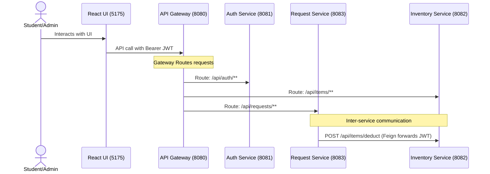

# College University Stationery Management System

This project is a five-day capstone build for a college stationery store. It uses Spring Boot microservices, Spring Cloud, JWT security, a React UI, Docker, and a Jenkins pipeline.

## Modules

```text
backend/
  discovery-server
  config-server
  api-gateway
  auth-service
  inventory-service
  request-service
frontend/


ci-cd/
docs/
```

## System Architecture & Directory Map

The system is split into three main components: a frontend application, a backend microservice suite, and CI/CD/infrastructure configuration files.

### 1. Frontend
* **[frontend/](file:///c:/Users/u_raj/Demo%20Sprint/frontend)**: A React Single Page Application (SPA) built with Vite and styled with custom vanilla CSS.
  * **[main.jsx](file:///c:/Users/u_raj/Demo%20Sprint/frontend/src/main.jsx)**: The core UI hub containing the application routing, authorization screens, stationery catalog view, student request submission forms, and admin approval tables. It targets the API Gateway (port 8080) for all network interactions.

### 2. Backend Services
* **[discovery-server/](file:///c:/Users/u_raj/Demo%20Sprint/backend/discovery-server)** (Port 8761): Running a Netflix Eureka Server. It registers all backend microservice instances dynamically so they can locate each other using hostnames.
* **[config-server/](file:///c:/Users/u_raj/Demo%20Sprint/backend/config-server)** (Port 8888): A Spring Cloud Config Server running in native profile mode to serve shared configurations from a local folder classpath.
* **[api-gateway/](file:///c:/Users/u_raj/Demo%20Sprint/backend/api-gateway)** (Port 8080): Running Spring Cloud Gateway. It provides a single client entry point, routes traffic to downstream services (such as auth, inventory, and request), and manages global CORS rules.
* **[auth-service/](file:///c:/Users/u_raj/Demo%20Sprint/backend/auth-service)** (Port 8081): Manages user registration and login, password encryption using BCrypt, and signs HMAC-SHA256 JWT tokens containing user metadata (`userId`, `role`, `fullName`, `email`).
* **[inventory-service/](file:///c:/Users/u_raj/Demo%20Sprint/backend/inventory-service)** (Port 8082): Owns the stationery catalog items, manages stock levels, and records inventory adjustments in audit logs.
* **[request-service/](file:///c:/Users/u_raj/Demo%20Sprint/backend/request-service)** (Port 8083): Manages stationery request submissions (`PENDING`, `APPROVED`, `REJECTED`, `FULFILLED`). Communicates with the `inventory-service` using an OpenFeign client to deduct stock during approval.

### 3. CI/CD & Infrastructure
* **[ci-cd/](file:///c:/Users/u_raj/Demo%20Sprint/ci-cd)**: Holds the [docker-compose.yml](file:///c:/Users/u_raj/Demo%20Sprint/ci-cd/docker-compose.yml) deployment file (packaging MySQL and all backend/frontend applications into a shared network) and the [Jenkinsfile](file:///c:/Users/u_raj/Demo%20Sprint/ci-cd/Jenkinsfile) pipeline defining checkout, backend testing, packaging, and Docker deployment stages.

---

## System Workflows & Inter-Service Communication



### 1. Authentication Flow
* **Login & Registration**: When a user registers or logs in, the request goes through the API Gateway to [auth-service](file:///c:/Users/u_raj/Demo%20Sprint/backend/auth-service).
* **JWT Generation**: [AuthService.java](file:///c:/Users/u_raj/Demo%20Sprint/backend/auth-service/src/main/java/com/stationery/auth/service/AuthService.java) generates a JWT signed with a shared secret containing roles (`ROLE_STUDENT` or `ROLE_ADMIN`) and student metadata.
* **Verification**: Subsequent requests contain the `Authorization: Bearer <token>` header. Downstream services (`inventory-service` and `request-service`) contain a custom `JwtAuthFilter` that parses the JWT signature locally and configures Spring's `SecurityContextHolder`.

### 2. Request Submission Flow
* **Submission**: A student submits a list of requested stationery items via the React frontend. The request is routed to [request-service](file:///c:/Users/u_raj/Demo%20Sprint/backend/request-service).
* **Audit & Storage**: The service extracts the student's email and ID from the JWT token claims, saves the new request in a `PENDING` state, and logs the action in the request audit logs.

### 3. Request Approval & Stock Deduction Flow
* **Trigger**: An Admin reviews the requests on their panel and clicks "Approve".
* **Inter-Service call (Feign)**: [StationeryRequestService.java](file:///c:/Users/u_raj/Demo%20Sprint/backend/request-service/src/main/java/com/stationery/request/service/StationeryRequestService.java) processes the approval. It iterates through the requested items and calls [InventoryClient.java](file:///c:/Users/u_raj/Demo%20Sprint/backend/request-service/src/main/java/com/stationery/request/client/InventoryClient.java) (Spring Cloud OpenFeign client) to deduct stock for each item in `inventory-service`.
* **Security Interceptor**: Because stock deduction in `inventory-service` is restricted to admins (`@PreAuthorize("hasRole('ADMIN')")`), the request service uses [FeignConfig.java](file:///c:/Users/u_raj/Demo%20Sprint/backend/request-service/src/main/java/com/stationery/request/config/FeignConfig.java) to copy the administrator's JWT token from the incoming controller thread and attach it to the outgoing Feign request.
* **Finalize**: If the stock deduction succeeds for all items, the request status transitions to `APPROVED`.

---

## Main Features

- Student and admin registration/login with BCrypt and JWT.
- Role-based API access for ADMIN and STUDENT.
- Inventory catalog with pagination and low-stock flags.
- Admin item creation and updates with audit logs.
- Student request submission with multiple request lines.
- Student request tracking by status.
- Admin approval/rejection. Approval deducts stock through Feign-based inter-service communication.
- Service registry, gateway routing, Dockerfiles, Docker Compose, and Jenkins CI/CD pipeline.

## Demo Users

| Role | Email | Password |
| --- | --- | --- |
| Admin | admin@college.edu | Admin@123 |
| Student | student@college.edu | Student@123 |

## Run Backend Locally

Start services in this order:

```bash
cd backend
mvn clean package
mvn -pl discovery-server spring-boot:run
mvn -pl config-server spring-boot:run
mvn -pl auth-service spring-boot:run
mvn -pl inventory-service spring-boot:run
mvn -pl request-service spring-boot:run
mvn -pl api-gateway spring-boot:run
```

Gateway URL:

```text
http://localhost:8080
```

## Run Frontend

```bash
cd frontend
npm install
npm run dev
```

React UI:

```text
http://localhost:5175
```

## Run With Docker

Package backend jars first:

```bash
cd backend
mvn clean package
```

Then:

```bash
docker compose -f ci-cd/docker-compose.yml up --build
```

## Tests

```bash
cd backend
mvn test
```

The service-layer tests use JUnit 5 and Mockito.

## Documentation

- API endpoints: `docs/api-contract.md`
- Database schema: `docs/database-schema.md`
- Environment setup: `docs/environment.md`
