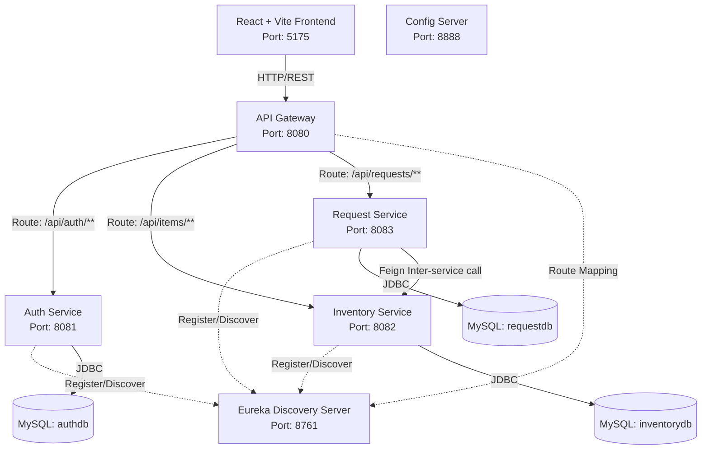
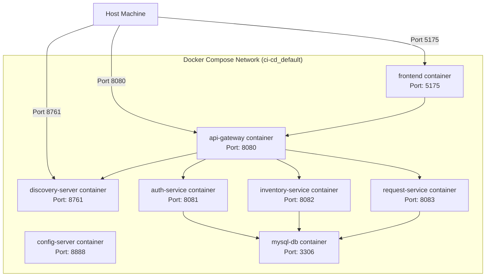

# High-Level Design (HLD)

## 1. System Architecture

The Stationery Management System is designed as a microservices architecture. It contains a React frontend and several backend services coordinated via service discovery and gateway routing.

## 2. Component Explanations

- **React Frontend**: A single-page application built with Vite and React that allows students to view inventory and submit requests, and admins to manage inventory and approve/reject requests.
- **API Gateway (Spring Cloud Gateway)**: Serves as the single entry point. Handles routing, cross-origin resource sharing (CORS), and load balancing to backend microservices.
- **Discovery Server (Netflix Eureka Server)**: Registers all backend services dynamically so they can locate each other using hostnames rather than hardcoded URLs.
- **Config Server (Spring Cloud Config Server)**: Centralized configuration server.
- **Auth Service**: Manages user authentication and registration. Uses BCrypt to secure passwords and generates JWTs for authentication.
- **Inventory Service**: Manages stationery catalog items.
- **Request Service**: Handles request lifecycle from submission, tracking, to stores office approval/rejection. Communicates with Inventory Service to deduct stock when approved.

## 3. Deployment Diagram

