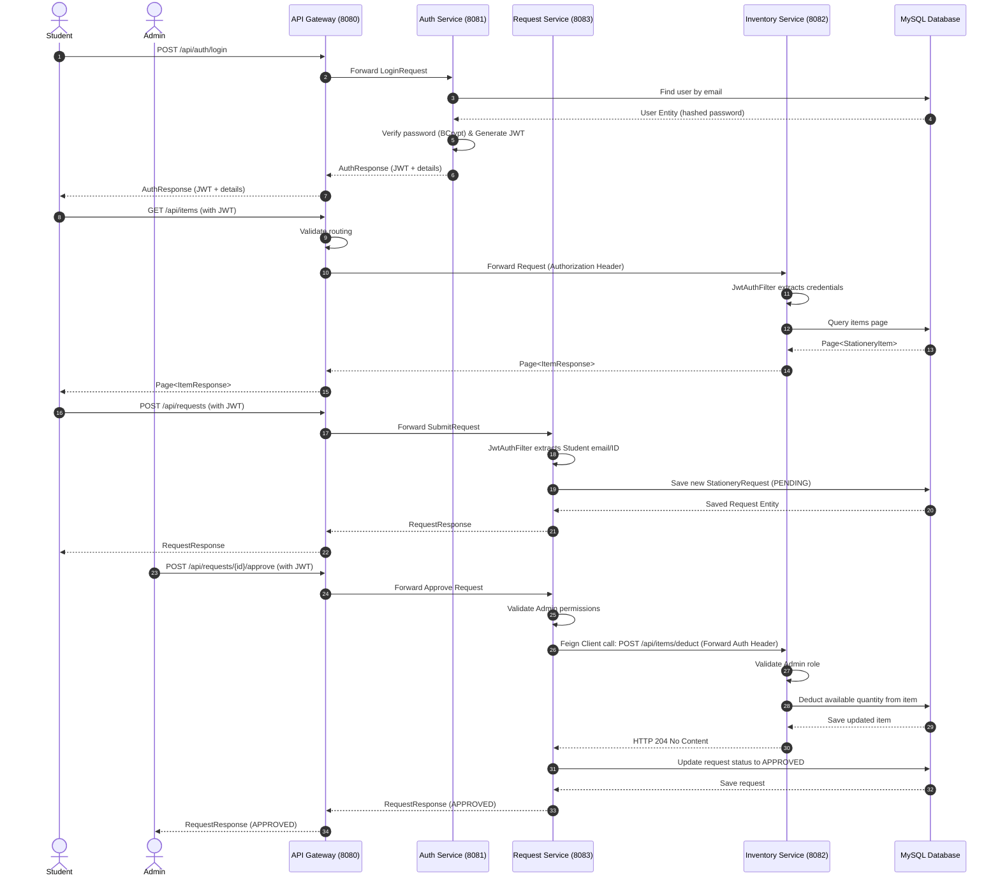

# Low-Level Design (LLD)

## 1. Sequence Diagram: Student Request & Admin Approval Flow

## 2. Security Design (JWT Validation)

All secured requests require a valid JSON Web Token (JWT) in the HTTP `Authorization` header under the `Bearer ` format.

- The gateway intercepts requests and forwards the `Authorization` header.
- Each downstream microservice contains a `JwtAuthFilter` extending Spring's `OncePerRequestFilter`.
- `JwtAuthFilter` parses and verifies the JWT signature against the configured `jwt.secret`.
- Roles (`ROLE_STUDENT` or `ROLE_ADMIN`) and student metadata (`userId`, `actorEmail`) are extracted from the claims and set in the Spring `SecurityContextHolder`.

## 3. Inter-service Communication

- The `Request Service` communicates with the `Inventory Service` using **Spring Cloud OpenFeign**.
- Feign clients are configured with a `RequestInterceptor` (`FeignConfig.java`) that automatically copy the `Authorization` header from the current incoming controller thread context to the outgoing Feign request. This preserves the security context of the user (specifically the Administrator role required for stock deduction).
